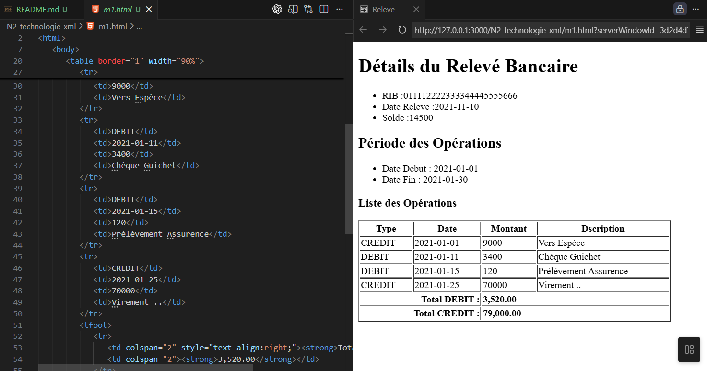
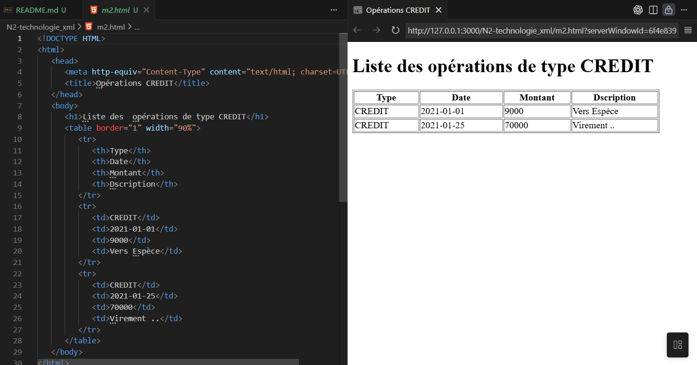
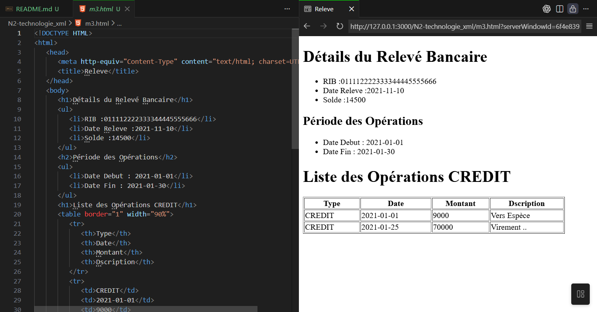

# xml-releve-bancaire

projet (TP XML) : gestion d’un relevé de compte bancaire stocké en XML.

## Structure du projet

- releve.xml : exemple de relevé
- releve.dtd : DTD du document XML
- releve.xsd : Schéma XML (XSD) du document
- releve-to-html.xsl : transformation XSLT vers HTML (toutes les opérations + totaux débit/crédit)
- releve-credit-only.xsl : transformation XSLT vers HTML (uniquement les opérations CREDIT)

## Remarques importantes

La structure graphique de l’arbre XML
-	Relevé Élément
-	RIB   Attributs

1. Date Relevé Élément
2. Solde       Élément
3. Operations   Élément
    - Date début  Attribut
    - Date Fin    Attribut

    3.1. Opération Élément EMPTY
    - Type      Attribut
    - Date      Attribut
    - Montant    Attribut
    - Description  Attribut

## Validation

### Avec DTD
Le fichier `releve.xml` contient :
```xml
<!DOCTYPE releve SYSTEM "releve.dtd">
```
[Details du Relevé Bancaire](m1.html)

[Liste des opérations de type CREDIT](m2.html)

[Details du Relevé Bancaire avec période et liste des opération](m3.html)
